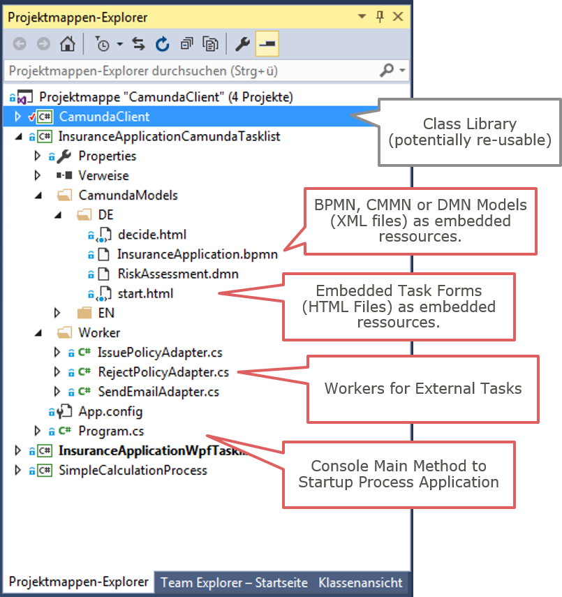
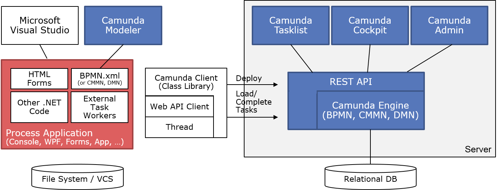
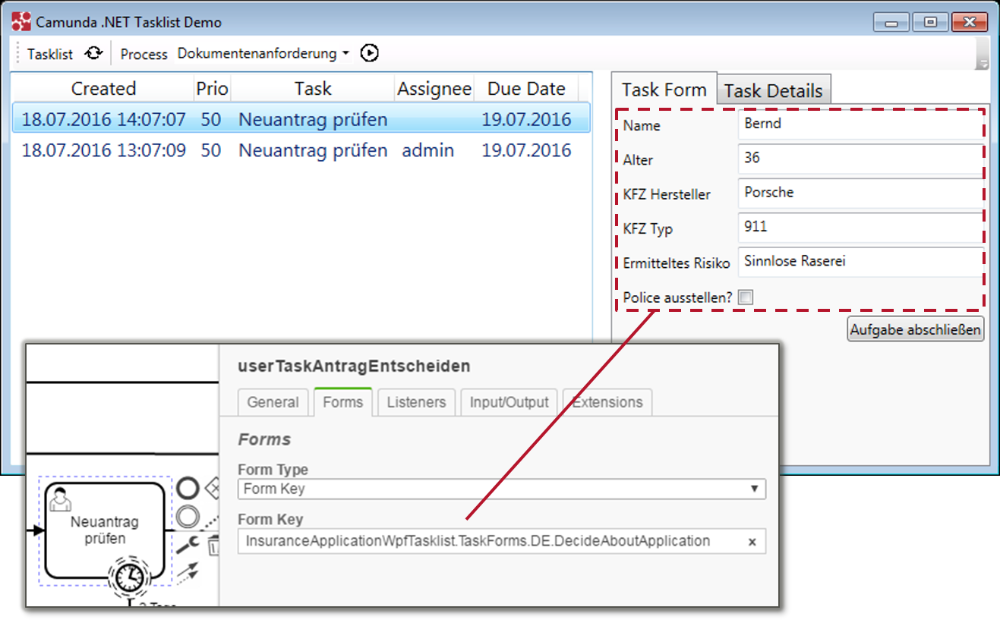

# Using Camunda BPM and .NET - Showcase using C&#35;

You do not need to code Java in order to develop on Camunda BPM. This Showcase demonstrates how to use Camunda BPM in combination with the .NET-Platform. All code examples are given in C#.

A class library named "Camunda Client" is contained, which can serve as a basis for your own projects using Camunda. It abstracts the details of remote communication with the Camunda BPM Platform.

# Camunda introduction blog posts

* [Use Camunda without touching Java and get an easy-to-use REST-based orchestration and workflow engine](https://blog.bernd-ruecker.com/use-camunda-without-touching-java-and-get-an-easy-to-use-rest-based-orchestration-and-workflow-7bdf25ac198e)

# Run the examples

* Make sure you have a Java Runtime on your machine (or [download and install Java](https://java.com/de/download/)).
* Download the [Community Edition of Camunda as Tomcat distribution](https://camunda.org/download/) (or any other distribution if you have a preference). Alternatively you might prefer to [try out the enterprise edition](https://camunda.com/trial/). 
* Unzip the distribution and start it using the batch file provided in the root folder.
* Clone or download the project provided in this GitHub repository and open it in Visual Studio
* Run the project of choice:
    * Insurance Application: Simple application process for a fictive car insruance. Implements the example shown in the [Camunda Poster](https://camunda.com/bpm/features/poster.php). Contains all models in German and English. 
         * [InsuranceApplicationCamundaTasklist](InsuranceApplicationCamundaTasklist/): Using the Camunda Tasklist and HTML forms
         * [InsuranceApplicationWpfTasklist](InsuranceApplicationWpfTasklist/): Using a WPF Tasklist and WPF pages for task details
    * [SimpleCalculationProcess](SimpleCalculationProcess/): Very easy process to get started
    * [Urlaubsantrag](Urlaubsantrag/): Very easy vacation request process in German to get started

# A Process Application in C&#35;

A process application might be a simple console application in C#. The following screenshot shows the content of the [InsuranceApplicationCamundaTasklist](InsuranceApplicationCamundaTasklist) console appplication:



It consists of:

* Models (BPMN, CMMN or DMN): You can add models to your application. If you configure them to be "embedded resources" they can be scanned by the "Camunda Client", which deployes them to the Camunda Engine via REST-API.

* External Task Workers: Service Tasks and Send Tasks can be implemented using [External Tasks](https://docs.camunda.org/manual/7.5/user-guide/process-engine/external-tasks/). This means, you only enter a so called "Topic"-Name in the BPMN model and query tasks for External Workers via REST API. The workers can be fully implememted in C#.

* Task Forms (HTML): If you want to use the [Camunda Tasklist](https://docs.camunda.org/manual/7.5/webapps/tasklist/) you can leverage [Embedded Task Forms] (https://docs.camunda.org/manual/7.5/user-guide/task-forms/#embedded-task-forms) - HTML Snippets which are shown for certain User Tasks. The HTML forms can be added to the application. If configured as "embedded resource" they can be scanned by the "Camunda Client", which deployes them to the Camunda Engine via REST-API.

If you do not want to use the Camunda Tasklist, you can also write your own

* Custom Tasklist: This showcase contains a complete Tasklist written in WPF. Now you can add WPF-Pages to be shown for certain User Tasks. 




## Implementing Service Tasks

When using the Camunda Client a Worker is as easy as [CalculationWorker](SimpleCalculationProcess/CalculationWorker.cs):

```java
    [ExternalTaskTopic("calculate")]
    [ExternalTaskVariableRequirements("x", "y")]
    class CalculationAdapter : IExternalTaskAdapter
    {

        public void Execute(ExternalTask externalTask, ref Dictionary<string, object> resultVariables)
        {
            long x = Convert.ToInt64(externalTask.variables["x"].value);
            long y = Convert.ToInt64(externalTask.variables["y"].value);
            long result = x + y;
            resultVariables.Add("result", result);
        }

}
```

## Adding Forms for User Tasks

You can use embeded forms (e.g. [Sample HTML Form](InsuranceApplicationCamundaTasklist/CamundaModels/DE/decide.html)) which are deployed within the Camunda Engine. Therefor add the form key:

```
camunda:formKey="embedded:deployment:CamundaModels.DE.decide.html"
```


# The Camunda Client Class Library

The Class Library [Camunda Client](https://github.com/berndruecker/camunda-csharp-client) is not meant to be a re-usable, stable component. It is meant to serve as example and can be a starting point for your own code. Feel free to copy and modify the code, as it is released under Apache License you can do what you want with the code.

## Startup
See [SimpleCalculationProcess Example´](SimpleCalculationProcess/Program.cs#L21-L24) on how-to start and stop the Camunda Client.

During Startup the client:

* Scans the classpath for Models (BPMN, CMMN and DMN) as well as HTML-Files. The files must be tagged as "embedded resource" to be part of the classpath! All found files are deployed to the Camunda Engine via REST-API.
* Scans the classpath for classes having the [ExternalTaskWorker](CamundaClient/Worker/ExternalTaskWorker.cs) attribute set. For all workers found a thread is started, which polls Camunda regurlary for new work and executes it if found.


## Stopping

Stopping the Camunda Client means to stop and dispose all running Threads.


# Writing your own Tasklist in WPF




You can also write a complete customized tasklist, e.g. as WPF application. In the [sample tasklist](InsuranceApplicationWpfTasklist) we provide here, we can load WPF pages as task forms for User Task. Instead of referencing HTML forms we now point to the class name (including namespace) in BPMN now:

```
camunda:formKey="InsuranceApplicationWpfTasklist.TaskForms.EN.DecideAboutApplication"
```
